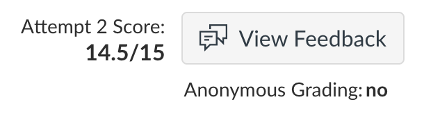

# MULTI-THREADED DICTIONARY SERVER

This is a assignment from COMP90015-Distributed Systems

More detail in report

# How to run

Server:

    java -jar DictionaryServer.jar <port> <dictionary-file>

Client:

    java -jar DictionaryClient.jar <server-address> <server-port>

## Mark

14.5/15

Deductions: (-0.5) too much discussion on GUI

